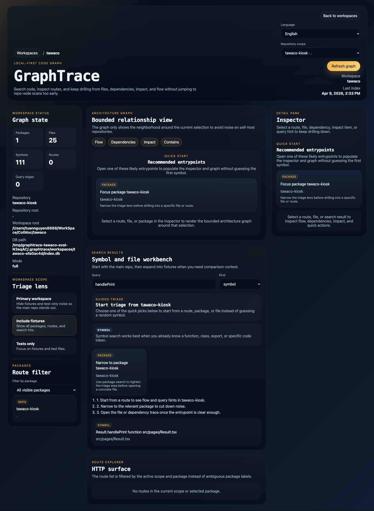
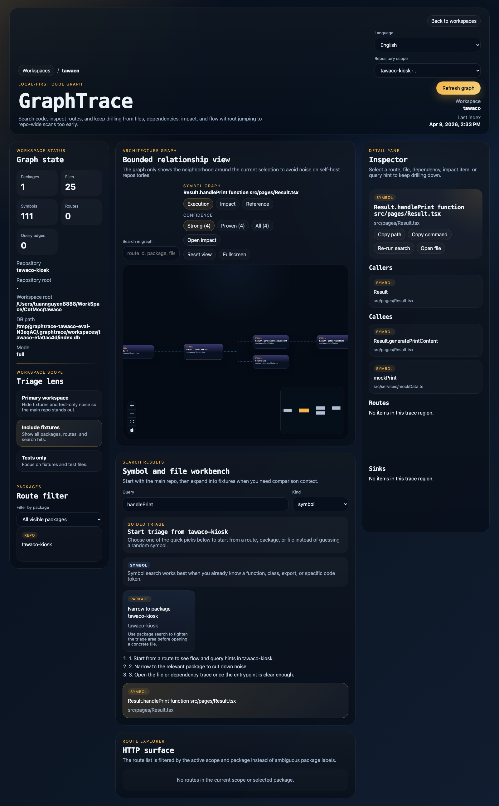

# GraphTrace

[](https://github.com/tuannguyen8888/GraphTrace/actions/workflows/ci.yml)
[](https://www.npmjs.com/package/graphtrace)
[](https://github.com/tuannguyen8888/GraphTrace/releases)
[](./LICENSE)

GraphTrace is a local-first code graph for JavaScript and TypeScript projects that helps developers understand the blast radius of a change before they touch the code.

In large repos, the hard part is rarely just writing the patch. The hard part is answering the questions that decide whether the patch is safe:

- Which files, packages, routes, and handlers are actually connected to this change?
- What breaks if I edit this service, symbol, or query path?
- How do I give an AI agent precise repository context without making it grep half the repo and burn tokens?

GraphTrace indexes your code into a local SQLite-backed graph, then exposes that understanding through:

- a CLI for engineers
- an MCP server for coding agents
- a local web UI for inspection

The goal is simple: make code changes safer, repo navigation faster, and AI-assisted development more reliable without shipping source code to a remote service by default.

## What It Looks Like

Workspace overview with graph-first triage, search, and workspace metadata in one local UI:



Symbol execution graph with callers, callees, inspector context, and quick actions for follow-up analysis:



## Why Developers Reach For GraphTrace

Use GraphTrace when you need to move quickly in a codebase but still want to know what you are changing.

- Change safety first: run impact analysis, dependency tracing, route discovery, and flow inspection before editing a file that could affect multiple packages or services.
- Faster understanding in large repos: build a local graph once, then search symbols, routes, files, packages, and unit boundaries without guessing where the architecture lives.
- Better AI context: expose the same graph through MCP so Codex, Claude Code, and Cursor can ask focused questions about the repo instead of doing broad filesystem scans.

GraphTrace is especially useful when you need fast answers to questions like:

- If I change this function, what else is likely to break?
- Which files or symbols call this method today?
- If I patch this screen, service, or package, what should I retest first?
- How do I give an AI coding agent precise repo context without pasting half the codebase into the prompt?

## What You Can Use Today

GraphTrace now supports JS/TS projects with automatic unit discovery.

Current capabilities include:

- workspace initialization and health checks
- automatic unit discovery across flat repos, monorepos, and mixed project roots
- full and incremental indexing into a local SQLite-backed graph store
- one daemon-backed UI that can manage many indexed workspaces
- foreground watch mode with stale cleanup on add, change, and delete
- search, dependency tracing, impact analysis, route flow, and workspace status
- route discovery for Express, Fastify, Nest, and Next App Router
- query hints for Prisma and Drizzle patterns
- MCP tools for search, deps, impact, flow, status, routes, packages, and reindex
- project-local agent bootstrap for Codex, Claude Code, and Cursor
- agent setup lifecycle commands for setup, status, JSON status, restore, and tool-scoped restore
- local HTTP API plus an inspection-focused web UI
- published npm CLI package plus GitHub release notes for tagged versions

## Install

### Use from npm

```bash
npm i -g graphtrace
```

The public package is available on npm as [`graphtrace`](https://www.npmjs.com/package/graphtrace). Tagged release notes live in [GitHub Releases](https://github.com/tuannguyen8888/GraphTrace/releases).

Or run ad hoc:

```bash
npx graphtrace doctor
pnpm dlx graphtrace doctor
```

### Work on this repo

```bash
pnpm install
pnpm lint
pnpm typecheck
pnpm test
pnpm build
pnpm test:smoke
```

## Quick Start

Initialize GraphTrace inside one repo when you want repo-local config/index files:

```bash
graphtrace init
```

Build the local index:

```bash
graphtrace index --full
graphtrace index --full --explain
```

Check workspace/index state:

```bash
graphtrace status
graphtrace status --json
graphtrace doctor --units
graphtrace doctor --plugins
```

Run incremental watch mode:

```bash
graphtrace watch --json --debounce-ms 250
```

Search the indexed graph:

```bash
graphtrace search listUsers --kind symbol
graphtrace routes
graphtrace deps apps/api/src/routes/users.ts --direction out --depth 2
graphtrace impact apps/api/src/services/user-service.ts --depth 4
graphtrace flow "GET /users"
```

Start the local web UI:

```bash
graphtrace web --port 4310
```

Or run one multi-workspace daemon and add repos into managed storage:

```bash
graphtrace workspace add /absolute/path/to/repo --label my-repo
graphtrace workspace list --json
graphtrace serve --port 4310
```

Useful multi-workspace lifecycle commands:

```bash
graphtrace workspace reindex <workspace-id>
graphtrace workspace remove <workspace-id>
```

Start the MCP server:

```bash
graphtrace mcp
```

Bootstrap project-local AI agent config:

```bash
graphtrace agent setup
graphtrace agent setup --dry-run
graphtrace agent setup --tool codex
graphtrace agent status
graphtrace agent status --json
graphtrace agent restore
graphtrace agent restore --tool codex
```

Typical workflow before a risky change:

```bash
graphtrace index --full
graphtrace impact apps/api/src/services/user-service.ts --depth 4
graphtrace deps apps/api/src/routes/users.ts --direction out --depth 2
graphtrace flow "GET /users"
```

Typical workflow before delegating a change to an AI coding agent:

```bash
graphtrace workspace add /absolute/path/to/repo --label my-repo
graphtrace serve --port 4310
graphtrace agent setup --tool codex
```

## AI Agent Setup

GraphTrace can generate project-local MCP and instruction files for:

- Codex
- Claude Code
- Cursor

Run:

```bash
graphtrace agent setup
```

This command writes only repository-local files. It does not mutate global user config outside the repo.

Generated files:

- Codex: `.codex/config.toml`, `.agents/skills/graphtrace/SKILL.md`
- Claude Code: `.mcp.json`, `.claude/CLAUDE.md`
- Cursor: `.cursor/mcp.json`, `.cursor/rules/graphtrace.mdc`

Useful options:

- `graphtrace agent setup --dry-run` previews planned changes without writing files
- `graphtrace agent setup --tool codex` limits setup to one supported tool

Lifecycle helpers:

- `graphtrace agent status` checks whether the project-local GraphTrace files are currently configured for each supported tool
- `graphtrace agent status --json` returns the same state in structured form for automation
- `graphtrace agent restore` rolls back the most recent `agent setup` run using the state file and backups stored under `.graphtrace`
- `graphtrace agent restore --tool codex` rolls back only one supported tool and keeps the remaining setup state intact

Why this helps:

- gives agents a shared local MCP entry for `graphtrace mcp`
- pins the Codex MCP working directory so GraphTrace resolves the repo-local `.graphtrace` data even when the tool launches from outside the workspace root
- teaches agents when to use GraphTrace tools like `search_code`, `get_dependencies`, `get_impact_analysis`, and `get_status`
- encourages narrow semantic queries before broad repository scans, which reduces wasted context and token usage

Manual step:

- after files are generated, approve the GraphTrace MCP in Codex, Claude Code, or Cursor if that tool prompts for trust or MCP approval

### Codex Workflow

If you want Codex to proactively use GraphTrace while working inside a repo, installing the npm package is not enough on its own. You also need project-local setup inside that repository.

Recommended sequence:

```bash
cd /absolute/path/to/repo
graphtrace workspace add . --label my-repo
graphtrace agent setup --tool codex
graphtrace agent status
```

After setup, Codex gets:

- a repo-local MCP entry that runs `graphtrace mcp`
- a local GraphTrace skill file that teaches when to prefer semantic graph queries over broad filesystem scans
- a shared project convention for asking search, dependency, impact, and status questions with less prompt waste

This is the difference between:

- having `graphtrace` installed on your machine
- having Codex actually know that it should use GraphTrace inside a specific repository

In practice, this makes Codex much better at repository triage questions such as:

- `What calls this function?`
- `What is the blast radius if we edit this file or symbol?`
- `What should we retest after touching this route, page, or service?`
- `Which package owns this path and what else depends on it?`

## Why Teams Use It

GraphTrace is designed to help both individual developers and teams answer the questions that usually slow code changes down:

- impact analysis before changing a file, service, or package boundary
- dependency tracing across packages and modules when a refactor might spread further than expected
- route discovery and route-to-code flow inspection when debugging request handling
- local code search across symbols, files, packages, routes, and discovered units
- structured repository context for AI agents through MCP instead of ad hoc prompt stuffing
- project-local agent setup so teams can standardize AI tooling per repository
- internal tooling powered from one graph/query backend instead of separate ad hoc scripts

## Architecture

GraphTrace uses a graph-first local architecture:

1. Source code is indexed into either a repo-local SQLite graph store or a managed per-workspace DB under `~/.graphtrace/workspaces/<workspaceId>/index.db`.
2. A central registry at `~/.graphtrace/registry.sqlite` tracks workspace metadata, snapshots, and lifecycle state for the daemon.
3. One query engine reads a selected workspace graph and answers search, dependency, impact, flow, route, and status questions.
4. The CLI, MCP server, local API server, and web UI all sit on top of the same local data model.

For more detail, see [docs/ARCHITECTURE.md](docs/ARCHITECTURE.md).

## Repository Layout

```text
apps/web              Local UI
packages/cli          Public CLI package
packages/config       Workspace configuration
packages/indexer      Source indexing
packages/mcp          MCP server
packages/query-engine Query layer
packages/server       Local HTTP API
packages/shared       Shared types
packages/storage      SQLite-backed graph store
fixtures/             Test workspaces
```

## Design Principles

- local-first by default
- open source
- AI optional
- static analysis first
- one local source of truth

## Documentation

- [CONTRIBUTING.md](CONTRIBUTING.md)
- [docs/ARCHITECTURE.md](docs/ARCHITECTURE.md)
- [docs/ROADMAP.md](docs/ROADMAP.md)
- [Releases](https://github.com/tuannguyen8888/GraphTrace/releases)
- [SECURITY.md](SECURITY.md)
- [SUPPORT.md](SUPPORT.md)

## Contributing

GraphTrace uses `main` as the stable branch for open source collaboration.

- open pull requests against `main`
- keep feature work on topic branches
- run `pnpm lint`, `pnpm typecheck`, `pnpm test`, `pnpm build`, and `pnpm test:smoke` before opening a pull request

See [CONTRIBUTING.md](CONTRIBUTING.md) for the full workflow.

## Support

- Use GitHub Discussions for questions and design discussion
- Use Issues for bugs and feature requests
- Use the security policy for responsible vulnerability reporting

See [SUPPORT.md](SUPPORT.md) and [SECURITY.md](SECURITY.md).

## License

Apache-2.0. See [LICENSE](LICENSE).
